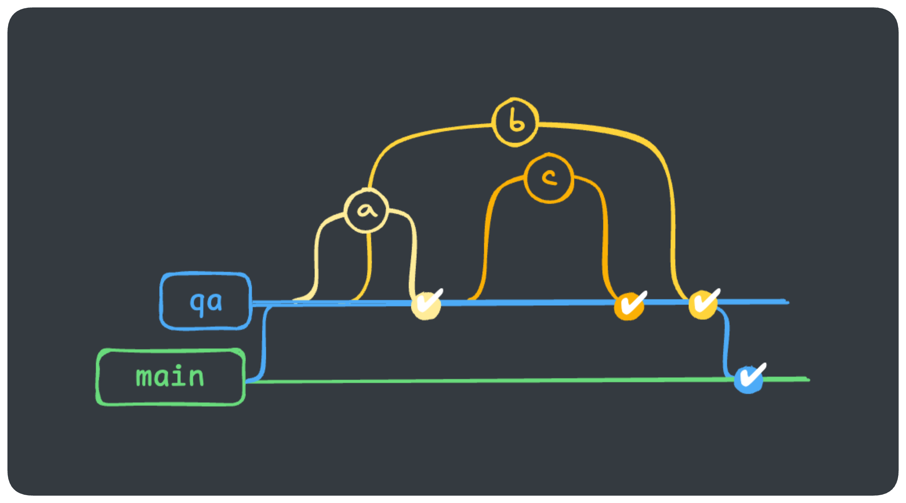
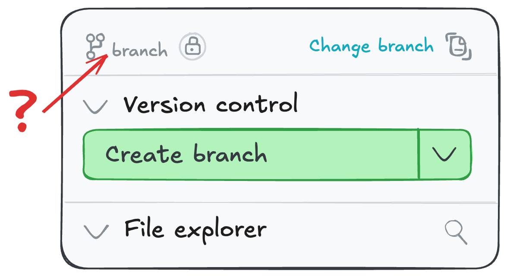

## EXERCISE 1: Configuring the Development Environment
Reviewing the branching strategy in _Figure 1_, configure the development 
environment with a **custom branch** so that developers will create new branches 
from the correct base.

_Figure 1 - Indirect Promotion Strategy_

### Instructions
1. Go to **Deploy** > **Environments**
2. Choose the “Development” environment > **Settings** > **Edit**
3. Choose the **Custom Branch** option and type the correct branch. **Save**.
4. Go to **Develop** > **Cloud** IDE and that the base branch is the one you configured:
   
5. In the command bar at the bottom of the IDE, type `dbt build` and press **Enter**. What are the results?
6. Finally, open up `_workshop_excercises/_exercise_prep.sql` and hit the **Compile** button to get information you need for the rest of the exercises - *be sure to copy/paste this because you won’t be in the IDE during these exercises!*

## EXERCISE 2: Configure the QA Deployment Environment

**Instructions**
1. Go to **Deploy** > **Environments** > **Create environment**
2. Set the environment up:
    - Environment name: `QA`
    - Check “only run on custom branch”, with value `qa`
    - Connection: **snowflake**
    - Database: `auto_deployment_qa`
    - Type: **Staging**
    - Fill in the user credentials:
        - Username → Use the username you grabbed from the first exercise
        - Password → Use the password you got from your account creation
        - Schema → Use the schema you noted and suffix it with `_analytics`.  
        - Example: `dbt_cberger_analytics`
    - Test the connection and if it's successful, hit **Save**.

## EXERCISE 3: Configure the QA Deployment Environment
1. Go to **Deploy** > **Environments** > **Create environment**
2. Set the environment up:
    - Environment name: `Production`
    - No custom branch
    - Connection: **snowflake**
    - Database: `auto_deployment_prod`
    - Type: **Production**
    - Fill in the user credentials:
        - Username → Use the username you grabbed from the first exercise
        - Password → Use the password you got from your account creation
        - Schema → Use the schema you noted and suffix it with `_analytics`.  
        - Example: `dbt_cberger_analytics`
    - Test the connection and if it's successful, hit **Save**.

## EXERCISE 4: Creating Deployment Jobs
1. Set up the QA job:
    - Name: `QA Daily`
    - Environment: `QA`
    - Command: `dbt build`
    - Trigger: **on a schedule at 5 UTC**
2. Set up the QA job:
    - Name: `Production Daily`
    - Environment: `Production`
    - Command: `dbt build`
    - Trigger: **on a schedule at 5 UTC**
3. After setting up the jobs, manually trigger both jobs to ensure they succeed.